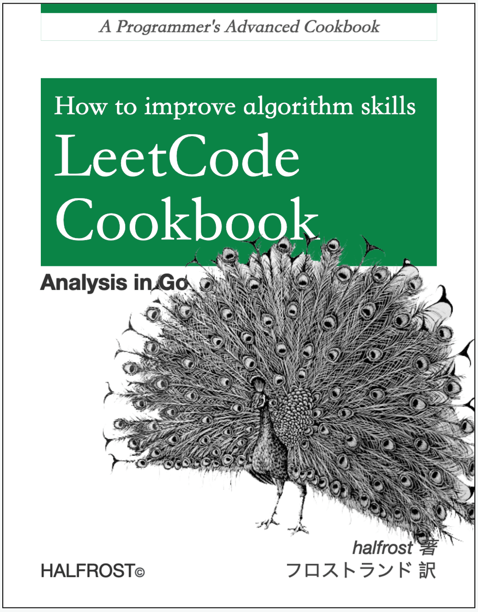
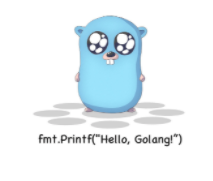

# Cookbook

## 关于 LeetCode
说到 [LeetCode](https://leetcode-cn.com)，作为一个程序员来说，应该不陌生，近几年参加面试都会提到它。
国内外的程序员用它刷题主要是为了面试。据历史记载，这个网站 2011 年就成立了，
马上就要到自己 10 周年的生日了。每周举行周赛，双周赛，月赛，在有限时间内编码，
确实非常能考验人的算法能力。一些大公司赞助冠名的比赛获得前几名除了有奖品，还能直接拿到内推的机会。

## 什么是 Cookbook
直译的话就是烹饪书，教你做各种食谱美食的书。经常看 [O'Reilly](https://baike.baidu.com/item/O%27Reilly?fr=aladdin) 技术书的同学对这个名词会很熟悉。一般动手操作，实践类的书都会有这个名字。

## 为什么会写这个开源书
笔者刷题刷了一年了，想和大家分享分享一些做题心得，解题方法。想和有相同爱好的人交个朋友，一起交流学习。对于自己来说，写题解也是一种提高。把一道深奥的题目讲给一点都没有头绪的人，并能让他完全听懂，很能锻炼人的表达能力。在讲解中很可能还会遇到听者的一些提问，这些问题可能是自己的知识漏洞，强迫自己去弥补。笔者在公司做过相关的分享，感受很深，双方受益都还不错。

> 另外，在大学期间，笔者做题的时候最讨厌写题解，感觉是浪费时间，用更多的时间去做更多的题。现在不知道算不算是“出来混的，总是要还的”。

## 关于书的封面
常看 O'Reilly 动物书的同学一看这个封面就知道是向他们致敬。确实是这个目的。O'Reilly 的封面动物都是稀缺动物，并且画风都是黑白素描风。这些动物都有版权了，所以只能在网上找没有版权的黑白素描风的图片。常见的能找到 40 张这种风格的图片。不过用的人太多了，笔者费劲的找了其他几张这种图片，这张孔雀开屏是其中一张。孔雀开屏的意义是希望大家刷完 LeetCode 以后，提高了自身的算法能力，在人生的舞台上开出自己的“屏”。全书配色也都是绿色，因为这是 AC 的颜色。

## 关于作者
笔者是一个刚刚入行一年半的 gopher 新人，还请各位大佬多多指点小弟我。大学参加了 3 年 ACM-ICPC，但是由于资质不高，没有拿到一块金牌。所以在算法方面，我对自己的评价算是新手吧。参加 ACM-ICPC 最大的收获是训练了思维能力，这种能力也会运用到生活中。其次是认识了很多国内很聪明的选手，看到了自己和他们的差距。最后，就是那 200 多页，有些自己都没有完全理解的，打印的密密麻麻的算法模板。知识学会了，终身都是自己的，没有学会，那些知识都是身外之物。

## 关于书中的代码
代码都放在 [github repo](https://github.com/) 中，按题号可以搜索到题目。

## END
