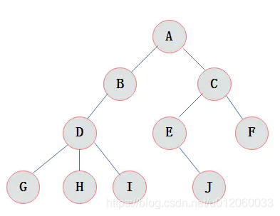
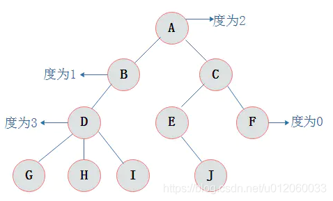
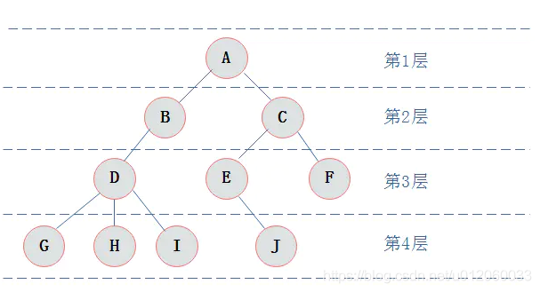
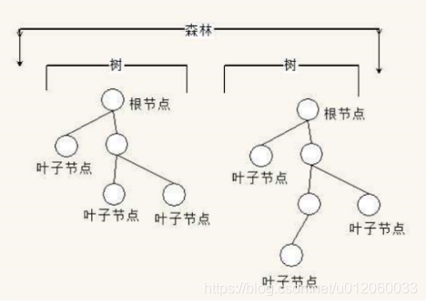
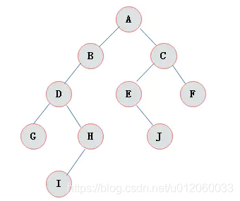
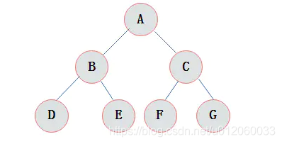
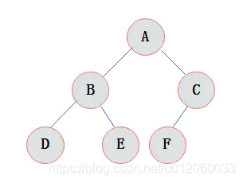
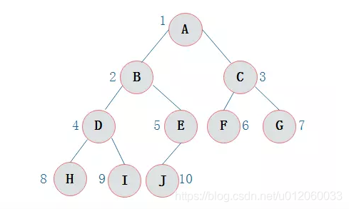

## 树

::: warning 前言
`树`是数据结构中的重中之重，尤其以各类二叉树为学习的难点.
:::

##  结点概念
`结点` 是数据结构中的基础，是构成复杂数据结构的基本组成单位

##  树结点声明
本系列文章中提及的结点专指`树的结点`。例如：结点A在图中表示为：
<br>


## 树的定义
::: tip 树的定义
树`（Tree）`是n（n>=0)个结点的有限集。`n=0时称为空树`。在任意一颗非空树中：

有且仅有一个特定的称为根`（Root）`的结点；
当n>1时，其余结点可分为m(m>0)个互不相交的有限集T1、T2、......、Tn，其中每一个集合本身又是一棵树，并且称为根的子树。
此外，树的定义还需要强调以下两点：

n>0时根结点是`唯一`的，不可能存在多个根结点，数据结构中的树只能有一个根结点。
m>0时，子树的个数没有限制，但它们一定是互不相交的。
示例树，下图所示为一棵普通的树：
:::


## 结点的度

::: tip 结点的度
结点拥有的子树数目称为结点的`度`
:::



### 结点层次
::: tip 节点层次
从根开始定义起，根为第一层，根的孩子为第二层，以此类推。
:::


## 树的深度
::: tip 树的深度
树中结点的`最大层次数`称为树的`深度`或`高度`。下图所示树的深度为4
:::


## 树的叶子结点
::: tip 树的子叶节点
子叶结点是树的底部段中的结点，`叶结点不具有子结点`。叶结点的结构比中间结点的结构稍微复杂一些。以便在格式化的叶结点中保存多个条目
如下图所示
:::


## 二叉树
::: tip 二叉树
二叉树是n(n>=0)个结点的有限集合，该集合或者为空集（称为空二叉树），或者由一个根结点和两棵互不相交的、分别称为根结点的`左子树`和`右子树`组成。
:::


## 二叉树的特点
::: tip 二叉树的特点
由二叉树定义以及图示分析得出二叉树有以下特点：
1. 每个结点最多有两颗子树，所以二叉树中不存在度大于2的结点。
2. `左子树`和`右子树`是有顺序的，次序不能任意颠倒。
3. 即使树中某结点只有一棵子树，也要区分它是左子树还是右子树。
:::

## 二叉树性质
::: tip 二叉树性质
1. 在二叉树的第i层上最多有2^i-1个节点 （i>=1）
2. 二叉树中如果深度为k,那么最多有2^k-1个节点。(k>=1）
3. `n0=n2+1`，其中`n0`表示度数为`0的节点数`，`n2`表示度数为`2的节点数`。
4. 在完全二叉树中，具有n个节点的完全二叉树的深度为[log2n]+1，其中[log2n]是向`下取整`。
5. 若对含 n个结点的完全二叉树从上到下且从左至右进行 1 至 n 的编号，则对完全二叉树中任意一个编号为i的结点有如下特性：
```
若i=1，则该结点是二叉树的根，无双亲, 否则，编号为[i/2]的结点为其双亲结点;
若 2i>n，则该结点无左孩子， 否则，编号为 2i 的结点为其左孩子结点；
若 2i+1>n，则该结点无右孩子结点， 否则，编号为2i+1的结点为其右孩子结点
```
:::

## 满二叉树
::: tip 满二叉树
在一棵二叉树中。如果所有分支结点都存在左子树和右子树，并且所有叶子都在同一层上，这样的二叉树称为满二叉树。
满二叉树的特点有：
1. 叶子只能出现在最下一层。出现在其它层就不可能达成平衡。
2. 非叶子结点的度一定是2
3. 在同样深度的二叉树中，满二叉树的结点个数最多，叶子数最多。
:::


## 完全二叉树
::: tip 完全二叉树
对一颗具有n个结点的二叉树按层编号，如果编号为i(1<=i<=n)的结点与同样深度的满二叉树中编号为i的结点在二叉树中位置完全相同，则这棵二叉树称为完全二叉树。
完全二叉树特点：
1. 叶子结点只能出现在最下层和次下层。
2. 最下层的叶子结点集中在树的左部。
3. 倒数第二层若存在叶子结点，一定在右部连续位置。
4. 如果结点度为1，则该结点只有左孩子，即没有右子树。
5. 同样结点数目的二叉树，完全二叉树深度最小。
:::


## 二叉树的存储结构
::: tip 二叉树的存储结构
1. 顺序存储
`二叉树的顺序存储结构就是使用一维数组存储二叉树中的结点，并且结点的存储位置，就是数组的下标索引。`
2. 二叉链表
`既然顺序存储不能满足二叉树的存储需求，那么考虑采用链式存储`
:::

## 二叉树遍历
::: tip 二叉树遍历
二叉树的遍历是指从二叉树的根结点出发，按照某种次序依次访问二叉树中的所有结点，使得每个结点被访问一次，且仅被访问一次。
二叉树的访问次序可以分为四种：
1. 前序遍历
2. 中序遍历
3. 后序遍历
4. 层序遍历
:::

### 前序遍历
::: tip 前序遍历
前序遍历通俗的说就是从二叉树的根结点出发，当第一次到达结点时就输出结点数据，按照先向左在向右的方向访问。
:::


访问顺序：ABDHIEJCFG
```
从根结点出发，则第一次到达结点A，故输出A; 继续向左访问，第一次访问结点B，故输出B；
按照同样规则，输出D，输出H；
当到达叶子结点H，返回到D，此时已经是第二次到达D，故不在输出D，进而向D右子树访问，D右子树不为空，则访问至I，第一次到达I，则输出I；
I为叶子结点，则返回到D，D左右子树已经访问完毕，则返回到B，进而到B右子树，第一次到达E，故输出E；
向E左子树，故输出J； 按照同样的访问规则，继续输出C、F、G；
```

### 中序遍历
::: tip 中序遍历
中序遍历就是从二叉树的根结点出发，当第二次到达结点时就输出结点数据，按照先向左在向右的方向访问
:::
访问顺序：HDIBJEAFCG
```
从根结点出发，则第一次到达结点A，不输出A，继续向左访问，第一次访问结点B，不输出B；继续到达D，H；
到达H，H左子树为空，则返回到H，此时第二次访问H，故输出H； H右子树为空，则返回至D，此时第二次到达D，故输出D；
由D返回至B，第二次到达B，故输出B； 按照同样规则继续访问，输出J、E、A、F、C、G；
```

### 后序遍历
::: tip 后序遍历
后序遍历就是从二叉树的根结点出发，当第三次到达结点时就输出结点数据，按照先向左在向右的方向访问。
:::
访问顺序：HIDJEBFGCA
```
从根结点出发，则第一次到达结点A，不输出A，继续向左访问，第一次访问结点B，不输出B；继续到达D，H；
到达H，H左子树为空，则返回到H，此时第二次访问H，不输出H； H右子树为空，则返回至H，此时第三次到达H，故输出H；
由H返回至D，第二次到达D，不输出D； 继续访问至I，I左右子树均为空，故第三次访问I时，输出I； 返回至D，此时第三次到达D，故输出D；
按照同样规则继续访问，输出J、E、B、F、G、C，A；
```

::: warning 提示
通过上述的介绍，已经对于二叉树有了初步的认识。本篇文章介绍的基础知识希望读者能够牢牢掌握，并且能够在脑海中建立一棵二叉树的模型，为后续学习打好基础
<br>
文章参考: [CSDN博客](https://blog.csdn.net/u012060033/article/details/107128291/)
:::