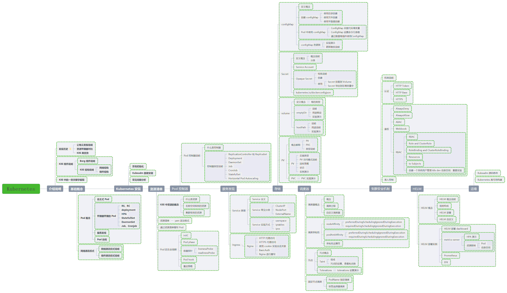
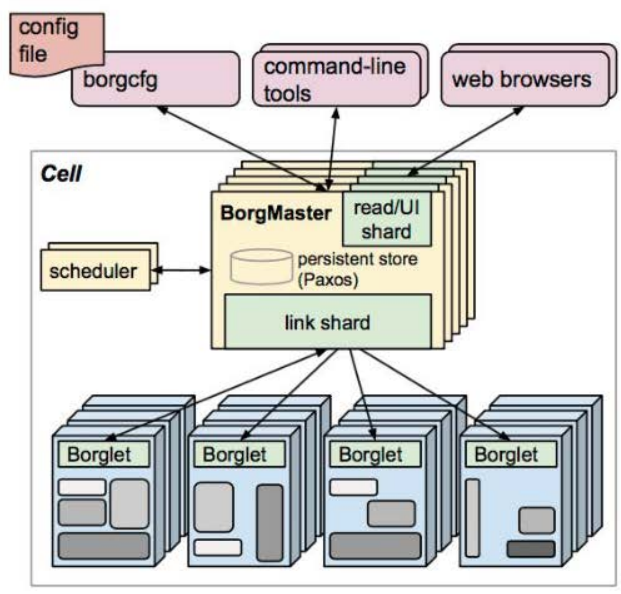
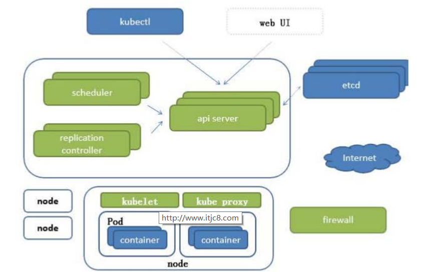
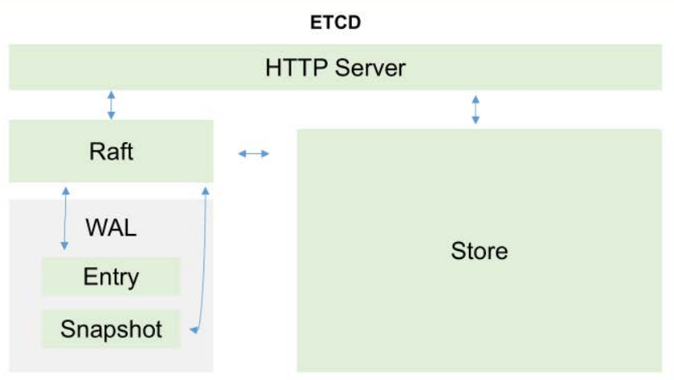
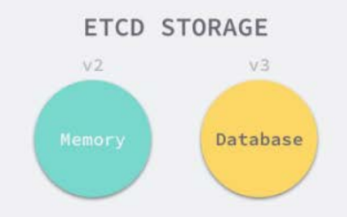

# Kubernetes 的组件介绍

## 发展经历
- 基础设施级服务infrastructure as a service 阿里云

- 平台设施级服务 platform as a service 新浪云

- 软件设施级服务 software as a service office365

Docker技术突飞猛进

- 一次构建，到处运行

- 容器的快速轻量

- 完整的生态环境

资源管理器
- apache MESOS (分布式资源管理框架) 2019-5 twitter 剔除-->

- docker swarm(功能少) 2019-07 阿里云宣布 docker swarm 剔除-->

- kubernetes (功能全面)--靠山是google 10年容器化基础架构 borg

- 采用go语言对borg进行反写

## 知识图谱

介绍说明： 前世今生 KUbernetes 框架 KUbernetes关键字含义

基础概念： 什么是 Pod 控制器类型 K8S 网络通讯模式

Kubernetes： 构建 K8S 集群

资源清单：资源 掌握资源清单的语法 编写 Pod 掌握 Pod 的生命周期***

Pod 控制器：掌握各种控制器的特点以及使用定义方式

服务发现：掌握 SVC 原理及其构建方式

存储：掌握多种存储类型的特点 并且能够在不同环境中选择合适的存储方案（有自己的简介）

调度器：掌握调度器原理 能够根据要求把Pod 定义到想要的节点运行

安全：集群的认证 鉴权 访问控制 原理及其流程

HELM：Linux yum 掌握 HELM 原理 HELM 模板自定义 HELM 部署一些常用插件

运维：修改Kubeadm 达到证书可用期限为 10年 能够构建高可用的 Kubernetes 集群

服务分类 有状态服务：DBMS 无状态服务：LVS APACHE 高可用集群副本数据最好是 >= 3 奇数个

## 组件说明

### bord结构图

### bubernetes结构图

### etcd存储
etcd的官方将它定位成一个可信赖的分布式键值存储服务,它能够为整个分布式集群存储一些关键数据,协助分布式集群的正常运转

注意

推荐在Kubernetes集群中使用Etcd v3, v2版本已在Kubernetes v1.11中弃用

### 插件说明
- APISERVER：所有服务访问统一入口

- CrontrollerManager：维持副本期望数目

- Scheduler：：负责介绍任务，选择合适的节点进行分配任务

- ETCD：键值对数据库 储存K8S集群所有重要信息（持久化）

- Kubelet：直接跟容器引擎交互实现容器的生命周期管理

- Kube-proxy：负责写入规则至 IPTABLES、IPVS 实现服务映射访问的

- COREDNS：可以为集群中的SVC创建一个域名IP的对应关系解析

- DASHBOARD：给 K8S 集群提供一个 B/S 结构访问体系

- INGRESS CONTROLLER：官方只能实现四层代理，INGRESS 可以实现七层代理

- FEDERATION：提供一个可以跨集群中心多K8S统一管理功能

- PROMETHEUS：提供K8S集群的监控能力

- ELK：提供 K8S 集群日志统一分析介入平台
