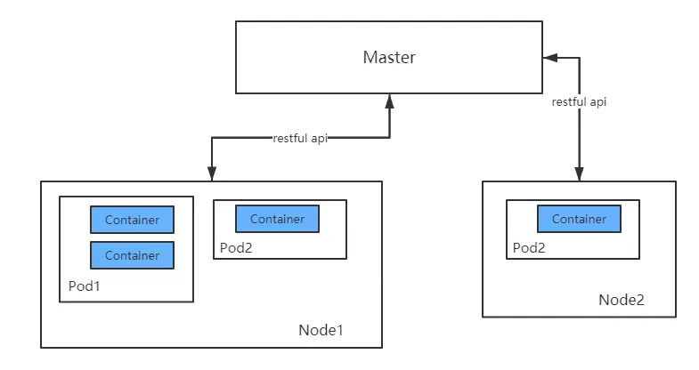
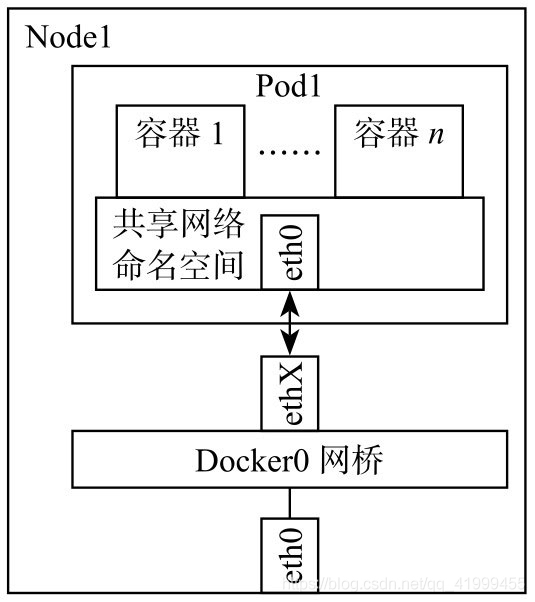
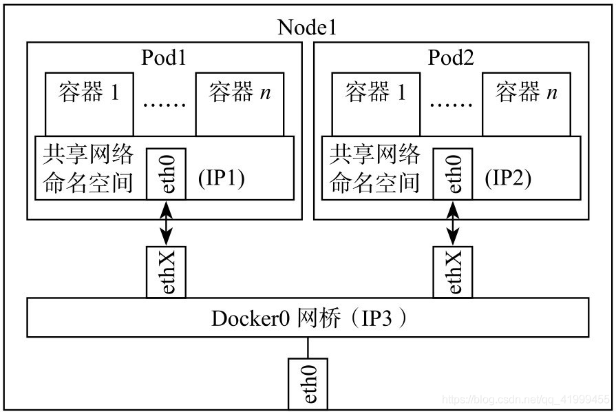
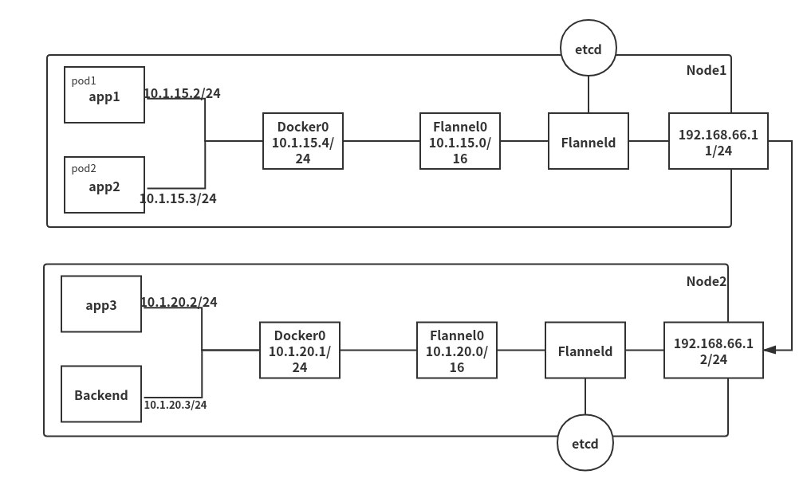
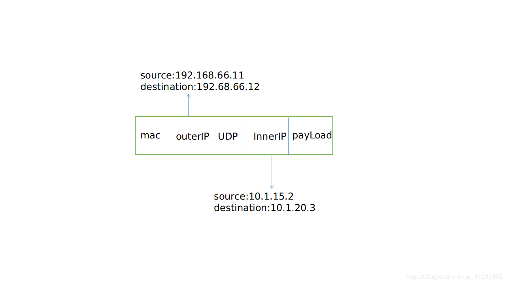

# Kubernetes 基础概念

## Pod
Pod是Kubernetes调度的最小单元。一个Pod可以包含一个或多个容器，因此它可以被看作是内部容器的逻辑宿主机。
Pod的设计理念是为了支持多个容器在一个Pod中共享网络和文件系统。因此处于一个Pod中的多个容器共享以下资源：
- PID命名空间：Pod中不同的应用程序可以看到其他应用程序的进程ID。
- network命名空间：Pod中多个容器处于同一个网络命名空间，因此能够访问的IP和端口范围都是相同的。也可以通过localhost相互访问。
- IPC命名空间：Pod中的多个容器共享Inner-process Communication命名空间，因此可以通过SystemV IPC或POSIX进行进程间通信。
- UTS命名空间：Pod中的多个容器共享同一个主机名。
- Volumes：Pod中各个容器可以共享在Pod中定义分存储卷（Volume）。

Pod、容器与Node（工作主机）之间的关系如下图所示：


### Pod的定义
通过yaml文件或者json描述Pod和其内容器的运行环境和期望状态，例如一个最简单的运行nginx应用的pod，定义如下：
```
apiVersion: v1
kind: Pod
metadata:
  name: nginx
  labels:
    app: nginx
spec:
  containers:
  - name: nginx
    image: nginx
    ports:
    - containerPort: 80
```
> 在生产环境中，推荐使用诸如Deployment，StatefulSet，Job或者CronJob等控制器来创建Pod，而不是直接创建。

将上述pod描述文件保存为nginx-pod.yaml，使用kubectl apply命令运行pod
`kubectl apply -f nginx-pod.yaml`

下面简要分析一下上面的Pod定义文件：
- apiVersion： 使用哪个版本的Kubernetes API来创建此对象
- kind：要创建的对象类型，例如Pod，Deployment等
- metadata：用于唯一区分对象的元数据，包括：name，UID和namespace
- labels：是一个个的key/value对，定义这样的label到Pod后，其他控制器对象可以通过这样的label来定位到此Pod，从而对Pod进行管理。（参见Deployment等控制器对象）
- spec： 其它描述信息，包含Pod中运行的容器，容器中运行的应用等等。不同类型的对象拥有不同的spec定义。详情参见API文档

> Kubernetes在每个Pod启动时，会自动创建一个镜像为gcr.io/google_containers/pause:version的容器，所有处于该Pod中的容器在启动时都会添加诸如--net=container:pause --ipc=contianer:pause --pid=container:pause的启动参数，因此pause容器成为Pod内共享命名空间的基础。所有容器共享pause容器的IP地址，也被称为Pod IP。

> 如果我们希望从外部访问这nginx应用，那么我们还需要创建Service对象来暴露IP和port。

### Pod的生命周期
- Pod的生命周期是Replication Controller进行管理的。一个Pod的生命周期过程包括：
- 通过yaml或json对Pod进行描述
- apiserver（运行在Master主机）收到创建Pod的请求后，将此Pod对象的定义存储在etcd中
- scheduler（运行在Master主机）将此Pod分配到Node上运行
- Pod内所有容器运行结束后此Pod也结束

在整个过程中，Pod通常处于以下的五种阶段之一：
- Pending：Pod定义正确，提交到Master，但其所包含的容器镜像还未完全创建。通常，Master对Pod进行调度需要一些时间，Node进行容器镜像的下载也需要一些时间，启动容器也需要一定时间。（写数据到etcd，调度，pull镜像，启动容器）。
- Running：Pod已经被分配到某个Node上，并且所有的容器都被创建完毕，至少有一个容器正在运行中，或者有容器正在启动或重启中。
- Succeeded：Pod中所有的容器都成功运行结束，并且不会被重启。这是Pod的一种最终状态。
- Failed：Pod中所有的容器都运行结束了，其中至少有一个容器是非正常结束的（exit code不是0）。这也是Pod的一种最终状态。
- Unknown：无法获得Pod的状态，通常是由于无法和Pod所在的Node进行通信。

### Restart policy
定义Pod时，可以指定restartPolicy字段，表明此Pod中的容器在何种条件下会重启。restartPolicy拥有三个候选值：
- Always：只要退出就重启
- OnFailure：失败退出时（exit code不为0）才重启
- Never：永远不重启

### 通过controller管理Pod
Pod本身不具备容错性，这意味着如果Pod运行的Node宕机了，那么该Pod无法恢复。因此推荐使用Deployment等控制器来创建Pod并管理。

一般来说，Pod不会自动消失，只能手动销毁或者被预先定义好的controller销毁。但有一种特殊情况，当Pod处于Succeeded或Failed阶段，并且超过一定时间后（由master决定），会触发超时过期从而被销毁。

总体上来说，Kubernetes中拥有三种类型的controller：
- Job。通常用于管理一定会结束的Pod。如果希望Pod被Job controller管理，那么*restartPolicy必须指定为OnFailure或Never。
- ReplicationController，ReplicaSet和Deployment。用于管理永远处于运行状态的Pod。如果希望Pod被此类controller管理，那么restartPolicy必须指定为Always。
- DaemonSet。它能够保证你的Pod在每一台Node都运行一个副本。


## Kubernetes 网络通信方式
> Kubernetes的网络通信方式是整个K8s的重点，所以更好的理解它的网络通信方式有助于我们更好的掌握Kubernetes。

Kubernetes网络设计模型：
- 基本原则：每个Pod都有一个独立的IP地址，而且假定所有的Pod都在一个可以直接联通、扁平的网络空间中；
- 设计原因：用户不需要额外考虑如何建立Pod之间的连接，也不需要将容器端口映射到主机端口的问题；
- 网络要求：所有的容器都可以在不用NAT的情况下于其他容器进行通信；所有Node都可以在不用NAT的情况下于其他容器进行通信；容器的地址和别人看到的地址是同一个；

主要包含四大类通信问题：
1. 同一个Pod中容器间的通信；
2. 同一Node不同Pod间的通信；
3. 不同Node间的Pod通信；
4. Pod与service之间的通信；

### 同一个pod中容器间的通信
同一个Pod的容器共享同一个网络命名空间，它们之间使用Puse的一个网络协议栈，可以理解为它们之间的访问可以通过localhost地址和容器端口实现；


### 同一Node不同Pod间的通信
同一Node不同Pod间是通过Docker网桥来进行数据包分配传输的，它们关联在同一个Docker0网桥上，地址网段相同，IP1、IP2、IP3属于同一个网段，所以它们之间能通信；


### 不同Node间的Pod通信
不同Node将的Pod通信是整个Kubernetes网络通信的难点，它基于`Flanneld`网络通信方式实现的；

::: tip Flannel
Flannel方式的通信是符合Kubernetes扁平化管理的理念；
Flannel通信是CoreOS团队针对Kubernetes设计的一个网络规划服务，简单来说它的功能就是让集群的不同节点主机创建的Docker容器都具有全集群唯一的虚拟IP地址。而且它还能够在这些IP地址之间建立一个覆盖网络（overlay
Network），通过这个覆盖网络将数据包原封不动的传递到对应的目标容器内。
:::
我们来通过下图来具体分析一下不同Node将的Pod通信，我们首先解释一下下图的Flannel：

Flannel相当于一个守护进程，它会监听一个端口，这个端口就是后续进行数据转发和数据接受的一个服务端口，如果Flannel成功启动，它就会开启一个Flannel0 的一个网桥，这个网桥专门去收集Docker0转发出来的数据包，可以理解为一个钩子函数；

Flanneld这里会有一堆的路由表信息，它是存储在etcd中由Flannel去自动拉取的，不同Pod间的通信就需要这些路由表来确定具体的转发路径；

::: tip etcd对Flannel提供如下说明
etcd对Flannel提供如下说明：
1、存储管理Flannel可分配的IP地址段资源；
2、监控ETCD中每个Pod的实际地址，并在内存中维护Pod节点路由表；
:::

如果此时需要Node1节点的app1发送数据包到达Node2节点的Backend，那就需要通过一下步骤来使得两者构建通信：
1. app1将自身IP地址、目标IP及其所发数据发送至Docker0的网桥；
2. Docker0获取到发送的数据包，由于目标IP的网段与当前Docker0的网段不是同一个，所以它会通过钩子函数抓取数据信息继续发送至Flannel0的网桥；
3. Flannel0网桥这时候会通过Flanneld中的路由表信息来确定具体的转发路径，此时会进行一个数据的二次封装，然后通过对应的外部节点IP（192.168.66.11/24）发送到目标外部IP（192.168.66.12/24）；
4. 发送到Node2节点之后会对数据包进行解析获取具体目标Pod的IP（10.1.20.3/24），然后发送到Backend从而完成整个Pod通信；

上述的数据包格式如下所示：


### Pod与service之间的通信
目前基于性能考虑，使用各节点的IPtables规则来进行网络通信；
---
在这里补充一下关于外网的网络通信：
1. Pod到外网：Pod向外网发送请求，查找路由表，转发数据包到宿主机的网卡，宿主网卡完成路由选择后，IPtables执行Masquerade，把源IP修改为宿主网卡的IP，然后向外网服务器发送请求；
2. 外网访问Pod：通过service来访问，一般使用NodePort；
