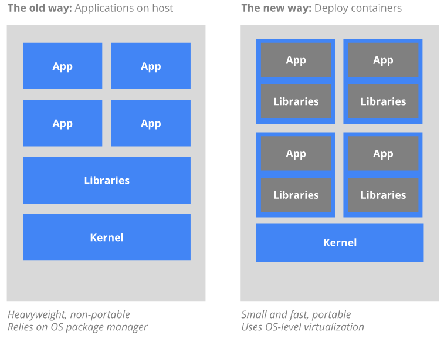

# kubernetes
Kubernetes是容器集群管理系统，是一个开源的平台，可以实现容器集群的自动化部署、自动扩缩容、维护等功能。

## 通过Kubernetes你可以：
- 快速部署应用
- 快速扩展应用
- 无缝对接新的应用功能
- 节省资源，优化硬件资源的使用

我们的目标是促进完善组件和工具的生态系统，以减轻应用程序在公有云或私有云中运行的负担。

## Kubernetes 特点
- ==可移植:== 支持公有云，私有云，混合云，多重云（multi-cloud）
- ==可扩展:== 模块化, 插件化, 可挂载, 可组合
- ==自动化:== 自动部署，自动重启，自动复制，自动伸缩/扩展

Kubernetes是Google 2014年创建管理的，是Google 10多年大规模容器管理技术`Borg`的开源版本。

## why containers?
为什么要使用`容器`？通过以下两个图对比：

传统的应用部署方式是通过插件或脚本来安装应用。这样做的缺点是应用的运行、配置、管理、所有生存周期将与当前操作系统绑定，这样做并不利于应用的升级更新/回滚等操作，当然也可以通过创建虚机的方式来实现某些功能，但是虚拟机非常重，并不利于可移植性。

新的方式是通过部署容器方式实现，每个容器之间互相隔离，每个容器有自己的文件系统 ，容器之间进程不会相互影响，能区分计算资源。相对于虚拟机，容器能快速部署，由于容器与底层设施、机器文件系统解耦的，所以它能在不同云、不同版本操作系统间进行迁移。

容器占用资源少、部署快，每个应用可以被打包成一个容器镜像，每个应用与容器间成一对一关系也使容器有更大优势，使用容器可以在build或release 的阶段，为应用创建容器镜像，因为每个应用不需要与其余的应用堆栈组合，也不依赖于生产环境基础结构，这使得从研发到测试、生产能提供一致环境。类似地，容器比虚机轻量、更“透明”，这更便于监控和管理。最后，

### 容器优势总结：
- 快速创建/部署应用：与VM虚拟机相比，容器镜像的创建更加容易。
- 持续开发、集成和部署：提供可靠且频繁的容器镜像构建/部署，并使用快速和简单的回滚(由于镜像不可变性)。
- 开发和运行相分离：在build或者release阶段创建容器镜像，使得应用和基础设施解耦。
- 开发，测试和生产环境一致性：在本地或外网（生产环境）运行的一致性。
- 云平台或其他操作系统：可以在 Ubuntu、RHEL、 CoreOS、on-prem、Google Container Engine或其它任何环境中运行。
- Loosely coupled，分布式，弹性，微服务化：应用程序分为更小的、独立的部件，可以动态部署和管理。
- 资源隔离
- 资源利用：更高效

## 使用Kubernetes能做什么？
可以在物理或虚拟机的Kubernetes集群上运行容器化应用，Kubernetes能提供一个以“容器为中心的基础架构”，满足在生产环境中运行应用的一些常见需求，如：

- 多个进程（作为容器运行）协同工作。（Pod）
- 存储系统挂载
- Distributing secrets
- 应用健康检测
- 应用实例的复制
- Pod自动伸缩/扩展
- Naming and discovering
- 负载均衡
- 滚动更新
- 资源监控
- 日志访问
- 调试应用程序
- 提供认证和授权

## Kubernetes不是什么？
Kubernetes并不是传统的PaaS（平台即服务）系统。

- Kubernetes不限制支持应用的类型，不限制应用框架。不限制受支持的语言runtimes (例如, Java, Python, Ruby)，满足12-factor applications 。不区分 “apps” 或者“services”。 Kubernetes支持不同负载应用，包括有状态、无状态、数据处理类型的应用。只要这个应用可以在容器里运行，那么就能很好的运行在Kubernetes上。
- Kubernetes不提供中间件（如message buses）、数据处理框架（如Spark）、数据库(如Mysql)或者集群存储系统(如Ceph)作为内置服务。但这些应用都可以运行在Kubernetes上面。
- Kubernetes不部署源码不编译应用。持续集成的 (CI)工作流方面，不同的用户有不同的需求和偏好的区域，因此，我们提供分层的 CI工作流，但并不定义它应该如何工作。
- Kubernetes允许用户选择自己的日志、监控和报警系统。
- Kubernetes不提供或授权一个全面的应用程序配置 语言/系统（例如，jsonnet）。
- Kubernetes不提供任何机器配置、维护、管理或者自修复系统。

另一方面，大量的Paas系统都可以运行在Kubernetes上，比如Openshift、Deis、Gondor。可以构建自己的Paas平台，与自己选择的CI系统集成。

由于Kubernetes运行在应用级别而不是硬件级，因此提供了普通的Paas平台提供的一些通用功能，比如部署，扩展，负载均衡，日志，监控等。这些默认功能是可选的。

另外，Kubernetes不仅仅是一个“编排系统”；它消除了编排的需要。“编排”的定义是指执行一个预定的工作流：先执行A，之B，然C。相反，Kubernetes由一组独立的可组合控制进程组成。怎么样从A到C并不重要，达到目的就好。当然集中控制也是必不可少，方法更像排舞的过程。这使得系统更加易用、强大、弹性和可扩展。

## Kubernetes是什么意思？
`Kubernetes`的名字来自希腊语，意思是“舵手” 或 “领航员”。K8s是将8个字母“ubernete”替换为“8”的缩写。
