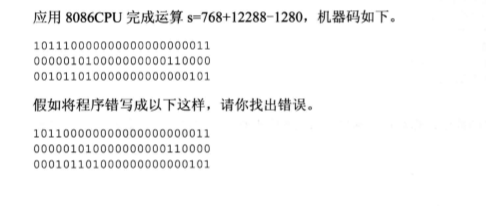
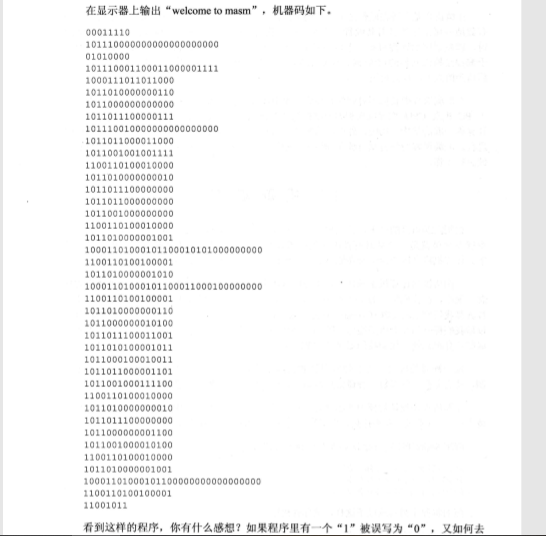
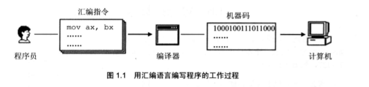
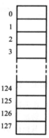
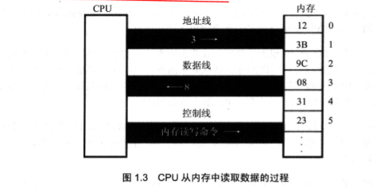
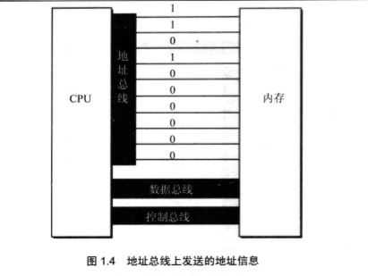
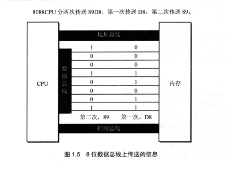
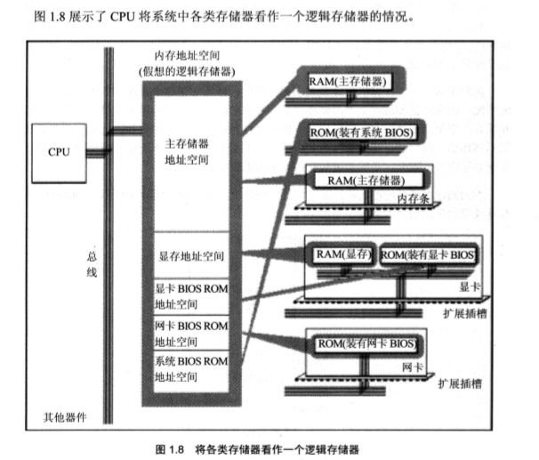
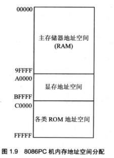

# 第一章 基础知识

## 1.1 机器语言
::: tip 机器语言
说到汇编语言的产生，首先要讲一下机器语言。机器语言是机器指令的集合。机器指令展开来讲就是一台机器可以正确执行的命令。电子计算机的机器指令是一列二进制数字。计算机将之转变为一列高低电平，以使计算机的电子器件受到驱动，进行运算。
上面所说的计算机指的是可以执行机器指令，进行运算的机器。这是早期计算机的概念。现在，在我们常用的PC机中，有一个芯片来完成上面所说的计算机的功能。这个芯片就是我们常说的CPU(Central Processing Unit，中央处理单元)，CPU是一种微处理器。以后我们提到的计算机是指由CPU和其他受CPU直接或间接控制的芯片、器件、设备组成的计算机系统，比如我们最常见的PC机。
每一种微处理器，由于硬件设计和内部结构的不同，就需要用不同的电平脉冲来控制，使它工作。所以每一种微处理器都有自己的机器指令集，也就是机器语言。
早期的程序设计均使用机器语言。程序员们将用0、1数字编成的程序代码打在纸带或卡片上，1打孔，0不打孔，再将程序通过纸带机或卡片机输入计算机，进行运算。
:::

应用8086CPU完成运算s=768+12288-1280，机器码如下。


书写和阅读机器码程序不是一件简单的工作，要记住所有抽象的二进制码。上面只是一个非常简单的小程序，就暴露了机器码的晦涩难懂和不易查错。写如此小的一个程序尚且如此，实际上一个有用的程序至少要有几十行机器码，那么，情况将怎么样呢?




## 1.2 汇编语言的诞生

   早期的程序员们很快就发现了使用机器语言带来的麻烦，它是如此难于辨别和记忆，给整个产业的发展带来了障碍。于是汇编语言产生了。

   汇编语言的主体是汇编指令。汇编指令和机器指令的差别在于指令的表示方法上。汇编指令是机器指令便于记忆的书写格式。

   例如 : 机器指令 `1000100111011000` 表示把寄存器BX的内容送到`AX` 中。汇编指令则写成`mov ax bx`。这样的写法与人类语言接近，便于阅读和记忆。

```
	操作 :   寄存器 BX 的内容送到 AX 中
	机器指令:1000100111011000
	汇编指令:mov ax,bx
```
   (寄存器，简单地讲是CPU中可以存储数据的器件，一个CPU中有多个寄存器。AX是其中一个寄存器的代号，BX是另一个寄存器的代号。更详细的内容我们在以后的课程中将会讲到。)

   此后，程序员们就用汇编指令编写源程序。可是，计算机能读懂的只有机器指令，那么如何让计算机执行程序员用汇编指令编写的程序呢?这时，就需要有一个能够将汇编指令转换成机器指令的翻译程序，这样的程序我们称其为编译器。程序员用汇编语言写出源程序，再用汇编编译器将其编译为机器码，由计算机最终执行。图1.1描述了这个工作过程。
   
   
   
## 1.3 汇编语言的组成
   
   汇编语言发展至今，有以下3类指令组成。
   
   ::: tip 指令组成
   1. 汇编指令: 机器码的助记符,有对应的机器码。
   2. 伪指令:   没有对应的机器码，由编译器执行，计算机并不执行。
   3. 其他符号: 如+、-、*、/等，由编译器识别，没有对应的机器码。汇编语言的核心是汇编指令，它决定了汇编语言的特性。
   :::
   
## 1.4 存储器
   
   CPU是计算机的核心部件，它控制整个计算机的运作并进行运算。要想让一个CPU工作，就必须向它提供指令和数据。指令和数据在存储器中存放，也就是我们平时所说的内存。在一台PC机中内存的作用仅次于CPU。离开了内存，性能再好的CPU也无法工作。这就像再聪明的大脑，没有了记忆也无法进行思考。磁盘不同于内存，磁盘上的数据或程序如果不读到内存中，就无法被CPU使用。要灵活地利用汇编语言编程，我们首先要了解CPU是如何从内存中读取信息，以及向内存中写入信息的。
   
## 1.5 指令和数据
   
   指令和数据是应用上的概念。在内存或磁盘上，指令和数据没有任何区别，都是二进制信息。CPU在工作的时候把有的信息看作指令，有的信息看作数据，为同样的信息赋予了不同的意义。就像围棋的棋子，在棋盒里的时候没有任何区别，在对弈的时候就有了不同的意义。

   例如，内存中的二进制信息 1000100111011000，计算机可以把它看作大小为89D8H的数据来处理,也可以将其看作指令mov ax,bx来执行。

   ```
   1000100111011000 -> 89D8H(数据)
   1000100111011000 -> mov ax,bx(程序)
   ```
   
## 1.6 存储单元

   存储器被划分成若干个存储单元，每个存储单元从О开始顺序编号，例如一个存储器有128个存储单元，编号从0～127，如图1.2所示。

   那么一个存储单元能存储多少信息呢?我们知道电子计算机的最小信息单位是_bit(音译为比特)，也就是一个二进制位。8个 bit组成一个 Byte，也就是通常讲的一个字节。微型机存储器的存储单元可以存储一个 Byte，即8个二进制位。一个存储器有128个存储单元，它可以存储128个 Byte。

   微机存储器的容量是以字节为最小单位来计算的。对于拥有128个存储单元的存储器，我们可以说，它的容量是128个字节。

   对于大容量的存储器一般还用以下单位来计量容量(以下用B来代表Byte):

   ```
  1MB=1024KB   1MB=1024KB   1GB=1024MB   1TB=1024GB
  磁盘的容量单位同内存的一样，实际上以上单位是微机中常用的计量单位。
   ```
   

## 1.7 CPU对存储器的读写
   
   以上讲到，存储器被划分成多个存储单元，存储单元从零开始顺序编号。这些编号可以看作存储单元在存储器中的地址。就像一条街，每个房子都有门牌号码。“
   
   CPU要从内存中读数据，首先要指定存储单元的地址。也就是说它要先确定它要读取哪一个存储单元中的数据。就像在一条街上找人，先要确定他住在哪个房子里。
   
   另外，在一台微机中，不只有存储器这一种器件。CPU在读写数据时还要指明，它要对哪一个器件进行操作，进行哪种操作，是从中读出数据，还是向里面写入数据。
   
   可见，CPU 要想进行数据的读写，必须和外部器件(标准的说法是芯片)进行下面3类信息的交互。
   
   ```
   1. 存储单元的地址(地址信
   2. 器件的选择，读或写的命令(控制信息);
   3. 读或写的数据(数据信息)。
   ```
   
   那么CPU是通过什么将地址、数据和控制信息传到存储器芯片中的呢?电子计算机能处理、传输的信息都是电信号，电信号当然要用导线传送。在计算机中专门有连接CPU 和其他芯片的导线，通常称为总线。总线从物理上来讲，就是一根根导线的集合。根据传送信息的不同，总线从逻辑上又分为3类，地址总线、控制总线和数据总线。

   CPU 从3号单元中读取数据的过程(见图1.3)如下。

   
   
   (1) CPU 通过地址线将地址信息3发出。<br>
   
   (2) CPU通过控制线发出内存读命令，选中存储器芯片，并通知它，将要从中读取数据<br>
   
   (3) 存储器将3号单元中的数据8通过数据线送入CPU。<br>
   
   ---
   写操作与读操作的步骤相似。如向3号单元写入数据26。
   
   (1) CPU通过地址线将地址信息3发出。<br>
   
   (2) CPU通过控制线发出内存写命令，选中存储器芯片，并通知它，要向其中写入数据。<br>
   
   (3) CPU通过数据线将数据26送入内存的3号单元中。
   
   从上面我们知道了CPU是如何进行数据读写的。可是，如何命令计算机进行数据的读写呢? 
   
   要让一个计算机或微处理器工作，应向它输入能够驱动它进行工作的电平信息(机器码)。对于8086CPU，下面的机器码，能够完成从3号单元读数据。
   
   ```
   机器码:
   101000010000001100000000
   
   含义:
   从3号单元读取数据送入寄存器AX
   
   CPU接收这条机器码后将完成我们上面所述的读写工作。机器码难于记忆，用汇编指令来表示，情况如下。
   
   机器码:
   10100001 00000011 00000000
     
   对应的汇编指令:MOV AX,[3]
   
   含义:
   传送3号单元的内容入AX
   
   ```
   
## 1.8 地址总线
   
   现在我们知道，CPU是通过地址总线来指定存储器单元的。可见地址总线上能传送多少个不同的信息，CPU 就可以对多少个存储单元进行寻址。
   
   现假设，一个CPU有10根地址总线，让我们来看一下它的寻址情况。我们知道，在电子计算机中，一根导线可以传送的稳定状态只有两种，高电平或是低电平。用二进制表示就是1或0，10根导线可以传送10位二进制数据。而10位二进制数可以表示多少个不同的数据呢?2的10次方个。最小数为0，最大数为1023.
   
   图1.4展示了一个具有10根地址线的CPU向内存发出地址信息11时10根地址线上传送的二进制信息。考虑一下，访问地址为12、13、14等的内存单元时，地址总线上传送的内容是什么?
   
   一个CPU有N根地址线，则可以说这个CPU的地址总线的宽度为N。这样的CPU最多可以寻找2的N次方个内存单元。
   
   


## 1.9 数据总线
   
   CPU_与内存或其他器件之间的数据传送是通过数据总线来进行的。数据总线的宽度决定了CPU和外界的数据传送速度。8根数据总线一次可传送一个8位二进制数据(即一个字节)。16根数据总线一次可传送两个字节。
   
   8088CPU的数据总线宽度为8，8086CPU的数据总线宽度为16。我们来分别看一下它们向内存中写入数据 89D8H时，是如何通过数据总线传送数据的。图1.5展示了8088CPU数据总线上的数据传送情况;图1.6展示了8086CPU数据总线上的数据传送情况。

   
   
## 1.10 控制总线
   
   CPU对外部器件的控制是通过控制总线来进行的。在这里控制总线是个总称，控制总线是一些不同控制线的集合。有多少根控制总线，就意味着CPU提供了对外部器件的多少种控制。所以，控制总线的宽度决定了CPU对外部器件的控制能力。
   
   前面所讲的内存读或写命令是由几根控制线综合发出的，其中有一根称为“读信号输出”的控制线负责由CPU向外传送读信号，CPU向该控制线上输出低电平表示将要读取数据:有一根称为“写信号输出”的控制线则负责传送写信号。

   
::: warning 1.1~1.10小结
 
(1) 汇编指令是机器指令的助记符,同机器指令一—对应。<br>
(2) 每一种 CPU 都有自己的汇编指令集。<br>
(3) CPU可以直接使用的信息在存储器中存放。<br>
(4) 在存储器中指令和数据没有任何区别，都是二进制信息。<br>
(5) 存储单元从零开始顺序编号。<br>
(6) 一个存储单元可以存储8个 bit，即8位二进制数。<br>
(7) 1Byte=8bit 1KB=1024B 1MB=1024KB 1GB=1024MB。<br>
(8)每一个CPU芯片都有许多管脚，这些管脚和总线相连。也可以说，这些管脚引出总线。一个CPU可以引出3种总线的宽度标志了这个CPU的不同方面的性能:
	<br>
	
	地址总线的宽度决定了CPU的寻址能力:
	
	数据总线的宽度决定了CPU与其他器件进行数据传送时的一次数据传送量:
	
	控制总线的宽度决定了 CPU对系统中其他器件的控制能力。
	
	
	
在汇编课程中，我们从功能的角度介绍了3类总线，对实际的连接情况不做讨论。
:::

## 1.11 内存地址空间(概述)

   什么是内存地址空间呢?举例来讲，一个CPU的地址总线宽度为_10，那么可以寻址1024个内存单元，这1024个可寻到的内存单元就构成这个CPU 的内存地址空间。下面进行深入讨论。首先需要介绍两部分基本知识，主板和接口卡。


## 1.12 主  板

   在每一台PC机中，都有一个主板，主板上有核心器件和一些主要器件，这些器件通过总线(地址总线、数据总线、控制总线)相连。这些器件有 CPU、存储器、外围芯片组、扩展插槽等。扩展插槽上一般插有RAM内存条和各类接口卡。


## 1.13 接 口 卡

   计算机系统中，所有可用程序控制其工作的设备，必须受到CPU 的控制。CPU对外部设备都不能直接控制，如显示器、音箱、打印机等。直接控制这些设备进行工作的是插在扩展插槽上的接口卡。扩展插槽通过总线和CPU相连，所以接口卡也通过总线同CPU相连。CPU可以直接控制这些接口卡，从而实现CPU对外设的间接控制。简单地讲，就是CPU通过总线向接口卡发送命令，接口卡根据CPU的命令控制外设进行工作。


## 1.14 各类存储器芯片

   一台PC机中，装有多个存储器芯片，这些存储器芯片从物理连接上看是独立的、不同的器件。从读写属性上看分为两类:随机存储器(RAM)和只读存储器(ROM)。随机存储器可读可写，但必须带电存储，关机后存储的内容丢失;只读存储器只能读取不能写入，关机后其中的内容不丢失。这些存储器从功能和连接上又可分为以下几类。

   1. 随机存储器。用于存放供CPU使用的绝大部分程序和数据，主随机存储器一般由两个位置上的RAM组成。装在主板上RAM和插在扩展插槽上的 RAM。

   2. 装有BIOS(Basic Input/Output System，基本输入/输出系统)的 ROM BIOS是由主板和各类接口卡(如显卡、网卡等)厂商提供的软件系统，可以通过它利用该硬件设备进行最基本的输入输出。在主板和某些接口卡上插有存储相应BIOS的 ROM。例如，主板上的_ROM中存储着主板的 BIOS(通常称为系统BIOS);显卡上的 ROM中存储着显卡的 BIOS;如果网卡上装有ROM，那其中就可以存储网卡的BIOs.

   3. 接口卡上的RAM。某些接口卡需要对大批量输入、输出数据进行暂时存储，在其上装有RAM。最典型的是显示卡上的 RAM，一般称为显存。显示卡随时将显存中的数据向显示器上输出。换句话说，我们将需要显示的内容写入显存，就会出现在显示器上。

   
   

## 1.15 内存地址空间

   上述的那些存储器，在物理上是独立的器件，但是在以下两点上相同。

   1. 都和CPU的总线相连。

   2. CPU对它们进行读或写的时候都通过控制线发出内存读写命令。

   这也就是说，CPU在操控它们的时候，把它们都当作内存来对待，把它们总的看作一个由若干存储单元组成的逻辑存储器，这个逻辑存储器就是我们所说的内存地址空间。在汇编这门课中，我们所面对的是内存地址空间。

   
   
   在图1.8 中，所有的物理存储器被看作一个由若干存储单元组成的逻辑存储器，每个物理存储器在这个逻辑存储器中占有一个地址段，即一段地址空间。CPU在这段地址空间中读写数据，实际上就是在相对应的物理存储器中读写数据。

   假设，图1.8中的内存地址空间的地址段分配如下。
   
   地址0~TFFFH的32KB空间为主随机存储器的地址空间;
   
   地址8000H~9FFFH的8KB空间为显存地址空间;
   
   地址A000H~FFFFH的24KB空间为各个ROM的地址空间。

   这样，CPU向内存地址为_1000H的内存单元中写入数据，这个数据就被写入主随机存储器中;CPU向内存地址为8000H 的内存单元中写入数据，这个数据就被写入显存中，然后会被显卡输出到显示器上;CPU向内存地址为C000H 的内存单元中写入数据的操作是没有结果的，CO00H单元中的内容不会被改变，CO00H单元实际上就是ROM存储器中的一个单元。

   内存地址空间的大小受CPU地址总线宽度的限制。8086CPU的地址总线宽度为20,可以传送2^20个不同的地址信息(大小从О 至2^20-1)。即可以定位2^20个内存单元，则8086PC的内存地址空间大小为 1MB。同理，80386CPU 的地址总线宽度为32，则内存地址空间最大为4GB。

   我们在基于一个计算机硬件系统编程的时候，必须知道这个系统中的内存地址空间分配情况。因为当我们想在某类存储器中读写数据的时候，必须知道它的第一个单元的地址和最后一个单元的地址，才能保证读写操作是在预期的存储器中进行。比如，我们希望向显示器输出一段信息，那么必须将这段信息写到显存中，显卡才能将它输出到显示器上。要向显存中写入数据，必须知道显存在内存地址空间中的地址。

   不同的计算机系统的内存地址空间的分配情况是不同的，图1.9展示了8086PC机内存地址空间分配的基本情况。

   
   
   图1.9告诉我们，从地址0~9FFFF的内存单元中读取数据，实际上就是在读取主随机存储器中的数据;向地址A0000~BFFFF 的内存单元中写数据，就是向显存中写入数据，这些数据会被显示卡输出到显示器上;我们向地址CO000~FFFFF 的内存单元中写入数据的操作是无效的，因为这等于改写只读存储器中的内容。

### 内存地址空间
   
   最终运行程序的是CPU，我们用汇编语言编程的时候，必须要从CPU的角度考虑问题。对CPU来讲,系统中的所有存储器中的存储单元都处于一个统一的逻辑存储器中，它的容量受CPU寻址能力的限制。这个逻辑存储器即是我们所说的内存地址空间。
   
::: warning 
   对于初学者，这个概念比较抽象，我们在后续的课程中将通过一些编程实践，来增加感性认识。
:::


   
   


   
   

   