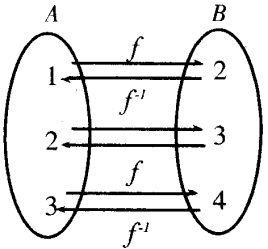
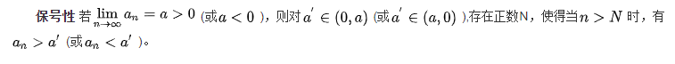
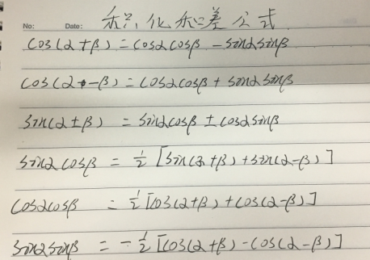
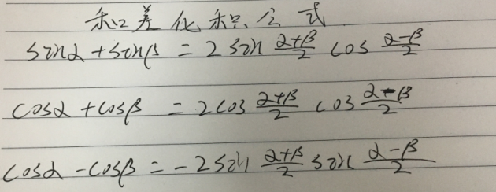

# 函数与极限

## 1.1 映射与函数
### 1.1.1映射
两个非空集合A与B间存在着对应关系f，而且对于A中的每一个元素a，B中总有唯一的一个元素b与它对应，就这种对应为从A到B的映射，记作f：A→B。其中，b称为元素a在映射f下的像 [1]  ，记作：b=f(a)。a称为b关于映射f的原像 [1]  。集合A中所有元素的像的集合称为映射f的值域

### 1.1.2函数
首先要理解，函数是发生在集合之间的一种对应关系。然后，要理解发生在A、B之间的函数关系不止且不止一个。最后，要重点理解函数的三要素。
函数的对应法则通常用解析式表示，但大量的函数关系是无法用解析式表示的，可以用图像、表格及其他形式表示 [2]  。
概念
在一个变化过程中，发生变化的量叫变量（数学中，变量为x，而y则随x值的变化而变化），有些数值是不随变量而改变的，我们称它们为常量。
自变量（函数）：一个与它量有关联的变量，这一量中的任何一值都能在它量中找到对应的固定值。
因变量（函数）：随着自变量的变化而变化，且自变量取唯一值时，因变量（函数）有且只有唯一值与其相对应。
函数值：在y是x的函数中，x确定一个值，y就随之确定一个值，当x取a时，y就随之确定为b，b就叫做a的函数值

### 函数的几种特性
#### 有界性
::: tip 有界性
就是y轴上的界限，比如baiy=sinx，-1<=y<=1，这就是方程的有界性du，而且有界性是zhi人为的，可以限定daox的取值范围，比如y=tanx，在x∈[-1,1]就是有界的
:::

#### 单调性
::: tip 单调性
函数总是在某个区域不断上升，又在某个区域不断下降，或者总是上升，或者总是下降，这就是函数的单调性
:::

#### 奇偶性
::: tip 奇偶性
函数图象按原点旋转180°重合，就是奇函数，函数图象按y轴折叠重合，就是偶函数，有奇函数、偶函数，也有非奇非偶函数，有公式确定
:::

#### 周期性
::: tip 周期性
函数图象在x轴上加一段距离，能反复出现，就是周期性，不是所有的函数都有周期性，也不是所有的周期函数都有最小正周期，比如f（x）=0
:::

## 1.2 数列的极限
数列的极限问题是我们学习的一个比较重要的部分，同时，极限的理论也是高等数学的基础之一。数列极限的问题作为微积分的基础概念，其建立与产生对微积分的理论有着重要的意义。

### 性质

::: tip 唯一性
唯一性 若数列 收敛，则它只有一个极限。
:::

::: tip 有界性
有界性 若数列 收敛，则 为有界数列，即存在正数 ，使得对一切正整数n有
:::

::: tip 保号性

:::

## 1.3 函数的极限

## 1.4 无穷小与无穷大

## 1.5 极限运算法则

## 1.6 极限存在准测  两个重要准则

## 1.7 无穷小的比较
formula
formula
formula
formula
formula
formula
formula
formula
formula
formula

## 1.8 函数的连续与间断点

## 1.9 连续函数的运算与初等函数的连续性

## 1.10 闭区间上连续函数的性质

## 公式

### 积化和差公式

### 和差化积
