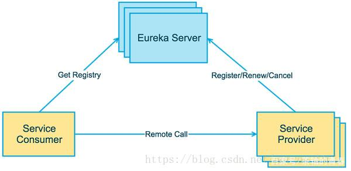

# 认识Spring Cloud

## Spring Cloud 是什么
1. 分布式系统框架，为开发者提供了一系列的构建分布式系统的工具集
2. 提供快速构建分布式系统中常见模式的工具（比如：配置管理，服务发现，断路器，智能路由，微代理，控制总线，全局锁，决策竞选，分布式会话和集群状态管理）
3. 方便的在任何分布式环境中部署与运行
4. Spring Cloud 基于SpringBoot 框架构建微服务架构

## Spring Cloud 的版本

Spring Cloud 最早在2014年推出

Spring Cloud 的版本并不是传统的数字命名，而是用 Angel,Brixton,Camden... 等伦敦的地名来命名，
版本的先后顺序使用字母 A-Z ,现在到 F 

## Spring Cloud 开发环境
IDEA

## Spring Cloud 整体架构

1. Server Provider: 暴露服务的服务提供方
2. Server Consumer: 调用远程服务的服务消费方
3. Eureka Server  ：服务注册中心和服务发现中心

