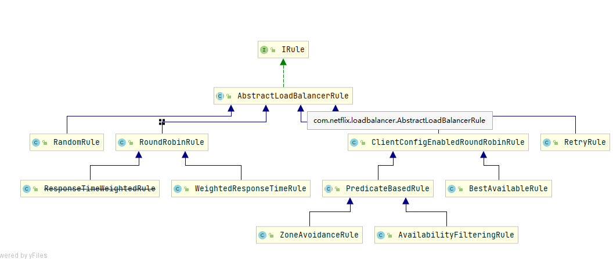

# 客户端负载均衡 Ribbon

## Spring Cloud 中的Ribbon 是什么
我们通常说的负载均衡就是将一个请求均匀的分配到不同的节点单元上执行，负载均衡可以分成 硬件负载均衡和软件负载均衡

硬件负载均衡： 比如 F5,深信服，Array 
软件负载均衡： 比如 Nginx , LVS, HAProxy

### Ribbon 和 Nginx 的区别
Ribbon 

Ribbon是客户端的负载均衡工具，而客户端负载均衡和服务端负载均衡最大的区别在于服务清单所存储的位置不同，
在客户端负载均衡中，所有客户端节点下的服务端清单需要自己从服务注册中心上获取，比如Eureka 服务注册中心。

同服务端负载均衡的架构类似，在客户端负载均衡中也需要心跳去维护服务端清单的健康性，只是这个步骤需要与服务
注册中心配合完成

在Spring Cloud中，Ribbon 主要与RestTempate 对象配合起来使用，Ribbon会自动化配置RestTemplate对象，
通过 `@LoadBalanced` 开启RestTemplate 对象调用时的负载均衡。

## Ribbon实现客户端负载均衡
由于Spring Cloud Ribbon 的封装，在我们微服务架构中使用客户端负载均衡调用简单，只需要两步骤：

1. 启动多个服务提供者实例并注册到一个服务注册中心或是服务注册中心集群。
2. 服务消费者通过被 `@LoadBalanced` 注解修饰过的RestTemplate 来调用服务提供者。

这样，我们就可以实现服务提供者的高可用以及服务消费者的负载均衡调用。


## Ribbon 负载均衡策略

Ribbon 的负载均衡策略是由IRule接口定义，


1. RandomRule： 随机
2. RoundRobinRule : 轮询
3. AvailabilityFilteringRule: 先过滤掉由于多次访问故障的服务，以及并发连接数超过阈值的服务，然后对剩下的服务按照轮询策略进行访问
...

### 覆盖原本策略
```
    /**
     *  覆盖掉原来ribbon默认的轮询负载均衡策略
     *  @return
     */

    @Bean
    public IRule iRule(){
        return new RandomRule();
    }
```

## Rest请求模板类解读

## 基于Rest的方式通常是四种情况
### GET请求

### POST请求
### PUT请求
### DELETE请求


