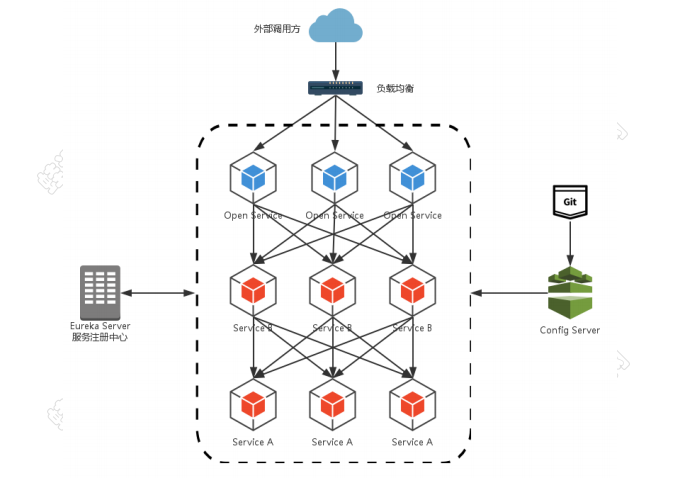
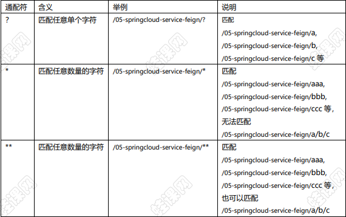
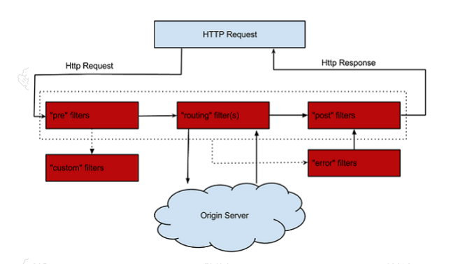

# API 网关 Zuul 

## Spring Cloud 的Zuul 是什么
通过前面内容的学习，我们已经可以基本搭建出一套简略版的微服务架构了，我
们有注册中心 Eureka，可以将服务注册到该注册中心中，我们有 Ribbon 或
Feign 可以实现对服务负载均衡地调用，我们有 Hystrix 可以实现服务的熔断，
但是我们还缺少什么呢？
我们首先来看一个微服务架构图


在上面的架构图中，我们的服务包括：内部服务 Service A 和内部服务 Service
B，这两个服务都是集群部署，每个服务部署了 3 个实例，他们都会通过 Eureka
Server 注册中心注册与订阅服务，而 Open Service 是一个对外的服务，也是
集群部署，外部调用方通过负载均衡设备调用 Open Service 服务，比如负载均
衡使用 Nginx，这样的实现是否合理，或者是否有更好的实现方式呢？接下来我
们主要围绕该问题展开讨论。
1. 如果我们的微服务中有很多个独立服务都要对外提供服务，那么我们要如何去管理这些接口？特别是当项目非常庞大的情况下要如何管理？

2. 在微服务中，一个独立的系统被拆分成了很多个独立的服务，为了确保安全,权限管理也是一个不可回避的问题，如果在每一个服务上都添加上相同的权限验证代码来确保系统不被非法访问，那么工作量也就太大了，而且维护也非常不方便。

为了解决上述问题，微服务架构中提出了 API 网关的概念，它就像一个安检站
一样，所有外部的请求都需要经过它的调度与过滤，然后 API 网关来实现请
求`路由`、`负载均衡`、`权限验证`等功能；
那么 Spring Cloud 这个一站式的微服务开发框架基于 Netflix Zuul 实现了
Spring Cloud Zuul，采用 Spring Cloud Zuul 即可实现一套 API 网关服务。

## 使用 Zuul 构建 API 网关
1、创建一个普通的 Spring Boot 工程名为 06-springcloud-api-gateway，然
后添加相关依赖，这里我们主要添加两个依赖 zuul 和 eureka 依赖：
```
<!--添加 spring cloud 的 zuul 的起步依赖-->
<dependency>
 <groupId>org.springframework.cloud</groupId>
 <artifactId>spring-cloud-starter-netflix-zuul</artifactId>
</dependency>
<!--添加 spring cloud 的 eureka 的客户端依赖-->
<dependency>
 <groupId>org.springframework.cloud</groupId>
 <artifactId>spring-cloud-starter-netflix-eureka-client</artifactId>
</dependency>
```

2、在入口类上添加@EnableZuulProxy 注解，开启 Zuul 的 API 网关服务功能：
```
@EnableZuulProxy //开启 Zuul 的 API 网关服务功能
@SpringBootApplication
public class Application {
 public static void main(String[] args) {
 SpringApplication.run(Application.class, args);
 }
}
```

3、在 application.properties 文件中配置路由规则：
```
#配置服务内嵌的 Tomcat 端口
server.port=8080
#配置服务的名称
spring.application.name=06-springcloud-api-gateway
#配置路由规则
zuul.routes.api-wkcto.path=/api-wkcto/**
zuul.routes.api-wkcto.serviceId=05-springcloud-service-feign
#配置 API 网关到注册中心上，API 网关也将作为一个服务注册到 eureka-server 上
eureka.client.service-url.defaultZone=http://eureka8761:8761/eureka/,http:/
/eureka8762:8762/eureka/
```
以上配置，我们的路由规则就是匹配所有符合/aike/**的请求，只要路径
中带有/api-aike/都将被转发到 server-feign 服务上，至于
server-feign 服务的地址到底是什么则由 eureka-server 注
册中心去分析，我们只需要写上服务名即可。
以我们目前搭建的项目为例，请求 http://localhost:8080/api-aike/web/hello 接口
则相当于请求 http://localhost:8082/web/hello
(server-feign 服务的地址为 http://localhost:8082/web/hello)，
路由规则中配置的 api-wkcto 是路由的名字，可以任意定义，但是一组 path 和
serviceId 映射关系的路由名要相同。
如果以上测试成功，则表示们的 API 网关服务已经构建成功了，我们发送的符
合路由规则的请求将自动被转发到相应的服务上去处理。

## 使用 Zuul 进行请求过滤
我们知道 Spring cloud Zuul 就像一个安检站，所有请求都会经过这个安检站，
所以我们可以在该安检站内实现对请求的过滤，下面我们以一个权限验证案例说
这一点：
1、我们定义一个过滤器类并继承自 ZuulFilter，并将该 Filter 作为一个 Bean：
```
import com.netflix.zuul.ZuulFilter;
import com.netflix.zuul.context.RequestContext;
import com.netflix.zuul.exception.ZuulException;
import org.springframework.stereotype.Component;

import javax.servlet.http.HttpServletRequest;

@Component
public class AuthFilter extends ZuulFilter {
    @Override
    public String filterType() {
        return "pre";
    }
    @Override
    public int filterOrder() {
        return 0;
    }
    @Override
    public boolean shouldFilter() {
        return true;
    }
    @Override
    public Object run() throws ZuulException {
        RequestContext ctx = RequestContext.getCurrentContext();
        HttpServletRequest request = ctx.getRequest();
        String token = request.getParameter("token");
        if (token == null) {
            ctx.setSendZuulResponse(false);
            ctx.setResponseStatusCode(401);

            ctx.addZuulResponseHeader("content-type","text/html;charset=utf-8");
            ctx.setResponseBody("非法访问");
        }
        return null;
    }
}

```

（1）filterType 方法的返回值为过滤器的类型，过滤器的类型决定了过滤器在哪个生命周期执行，pre 表示在路由之前执行过滤器，其他值还有 post、error、
route 和 static，当然也可以自定义。

（2）filterOrder 方法表示过滤器的执行顺序，当过滤器很多时，我们可以通过
该方法的返回值来指定过滤器的执行顺序。
（3）shouldFilter 方法用来判断过滤器是否执行，true 表示执行，false 表示不
执行。
（4）run 方法则表示过滤的具体逻辑，如果请求地址中携带了 token 参数的话，
则认为是合法请求，否则为非法请求，如果是非法请求的话，首先设置
ctx.setSendZuulResponse(false); 表示不对该请求进行路由，然后设置响应码
和响应值。这个 run 方法的返回值目前暂时没有任何意义，可以返回任意值。

##  Zuul 的路由规则
(1) 在前面的例子中：
```
#配置路由规则
zuul.routes.api-aike.path=/api-aike/**
zuul.routes.api-aike.serviceId=server-feign
```
当访问地址符合/api-aike/**规则的时候，会被自动定位到
server-feign 服务上，不过两行代码有点麻烦，还可以简化为：
```
zuul.routes.server-feign=/api-aike/**
```
zuul.routes 后面跟着的是服务名，服务名后面跟着的是路径规则，这种配置方式更简单

(2) 如果映射规则我们什么都不写，系统也给我们提供了一套默认的配置规则
默认的配置规则如下：
#默认的规则
zuul.routes.server-feign.path=/server-feign/**
zuul.routes.server-feign.serviceId=server-feign

(3) 默认情况下，Eureka 上所有注册的服务都会被 Zuul 创建映射关系来进行路由。
    但是对于我这里的例子来说，我希望：server-feign 提供服务；
	
	而 server-provider 作为服务提供者只对服务消费者提供服务，不对外提供服务。
	
如果使用默认的路由规则，则 Zuul 也会自动为
server-provider 创建映射规则，这个时候我们可以采用如下
方式来让 Zuul 跳过 server-provider 服务，不为其创建路由规则：
```
#忽略掉服务提供者的默认规则
zuul.ignored-services=server-provider
```
不给某个服务设置映射规则，这个配置我们可以进一步细化，比如说我不想给
/hello 接口路由，那我们可以按如下方式配置：
```
#忽略掉某一些接口路径
zuul.ignored-patterns=/**/hello/**
```

此外，我们也可以统一的为路由规则增加前缀，设置方式如下：
```
#配置网关路由的前缀
zuul.prefix=/myapi
```

(4) 路由规则通配符的含义：


(5) 一般情况下 API 网关只是作为各个微服务的统一入口，但是有时候我们可能
也需要在 API 网关服务上做一些特殊的业务逻辑处理，那么我们可以让请求到
达 API 网关后，再转发给自己本身，由 API 网关自己来处理，那么我们可以进
行如下的操作：
```
在 api-gateway 项目中新建如下 Controller：
@RestController
public class GateWayController {
 @RequestMapping("/api/local")
 public String hello() {
 return "exec the api gateway.";
 }
}
```
然后在 application.properties 文件中配置：
```
zuul.routes.gateway.path=/gateway/**
zuul.routes.gateway.url=forward:/api/local
```

## Zuul 的异常处理
Spring Cloud Zuul 对异常的处理是非常方便的，但是由于 Spring Cloud 处于
迅速发展中，各个版本之间有所差异，本案例是以 Finchley.RELEASE 版本为例，
来说明 Spring Cloud Zuul 中的异常处理问题。
首先我们来看一张官方给出的 Zuul 请求的生命周期图：


1. 正常情况下所有的请求都是按照 pre、route、post 的顺序来执行，然后由 post返回 response
2. 在 pre 阶段，如果有自定义的过滤器则执行自定义的过滤器
3. pre、routing、post 的任意一个阶段如果抛异常了，则执行 error 过滤器

我们可以有两种方式统一处理异常：
1、禁用 zuul 默认的异常处理 SendErrorFilter 过滤器，然后自定义我们自己的Errorfilter 过滤器
```
zuul.SendErrorFilter.error.disable=true
```

Errorfilter 过滤器

```
package com.aike.springcloud.filter;

import com.netflix.zuul.ZuulFilter;
import com.netflix.zuul.context.RequestContext;
import com.netflix.zuul.exception.ZuulException;
import org.slf4j.Logger;
import org.slf4j.LoggerFactory;
import org.springframework.stereotype.Component;
import org.springframework.util.ReflectionUtils;

import javax.servlet.http.HttpServletResponse;
import java.io.IOException;
import java.io.PrintWriter;


@Component
public class ErrorFilter extends ZuulFilter {
    private static final Logger logger = LoggerFactory.getLogger(ErrorFilter.class);
    @Override
    public String filterType() {
        return "error";
    }
    @Override
    public int filterOrder() {
        return 1;
    }
    @Override
    public boolean shouldFilter() {
        return true;
    }
    @Override
    public Object run() throws ZuulException {
        try {
            RequestContext context = RequestContext.getCurrentContext();
            ZuulException exception = (ZuulException)context.getThrowable();
            logger.error("进入系统异常拦截", exception);
            HttpServletResponse response = context.getResponse();
            response.setContentType("application/json; charset=utf8");
            response.setStatus(exception.nStatusCode);
            PrintWriter writer = null;
            try {
                writer = response.getWriter();
                writer.print("{code:"+ exception.nStatusCode +",message:\""+
                        exception.getMessage() +"\"}");
            } catch (IOException e) {
                e.printStackTrace();
            } finally {
                if(writer!=null){
                    writer.close();
                }
            }
        } catch (Exception var5) {
            ReflectionUtils.rethrowRuntimeException(var5);
        }
        return null;
    }
}


```

2、自定义全局 error 错误页面
```
@RestController
public class ErrorHandlerController implements ErrorController {
 /**
 * 出异常后进入该方法，交由下面的方法处理
 */
 @Override
 public String getErrorPath() {
 return "/error";
 }
 @RequestMapping("/error")
 public Object error(){
 RequestContext ctx = RequestContext.getCurrentContext();
 ZuulException exception = (ZuulException)ctx.getThrowable();
 return exception.nStatusCode + "--" + exception.getMessage();
 }
}
```
